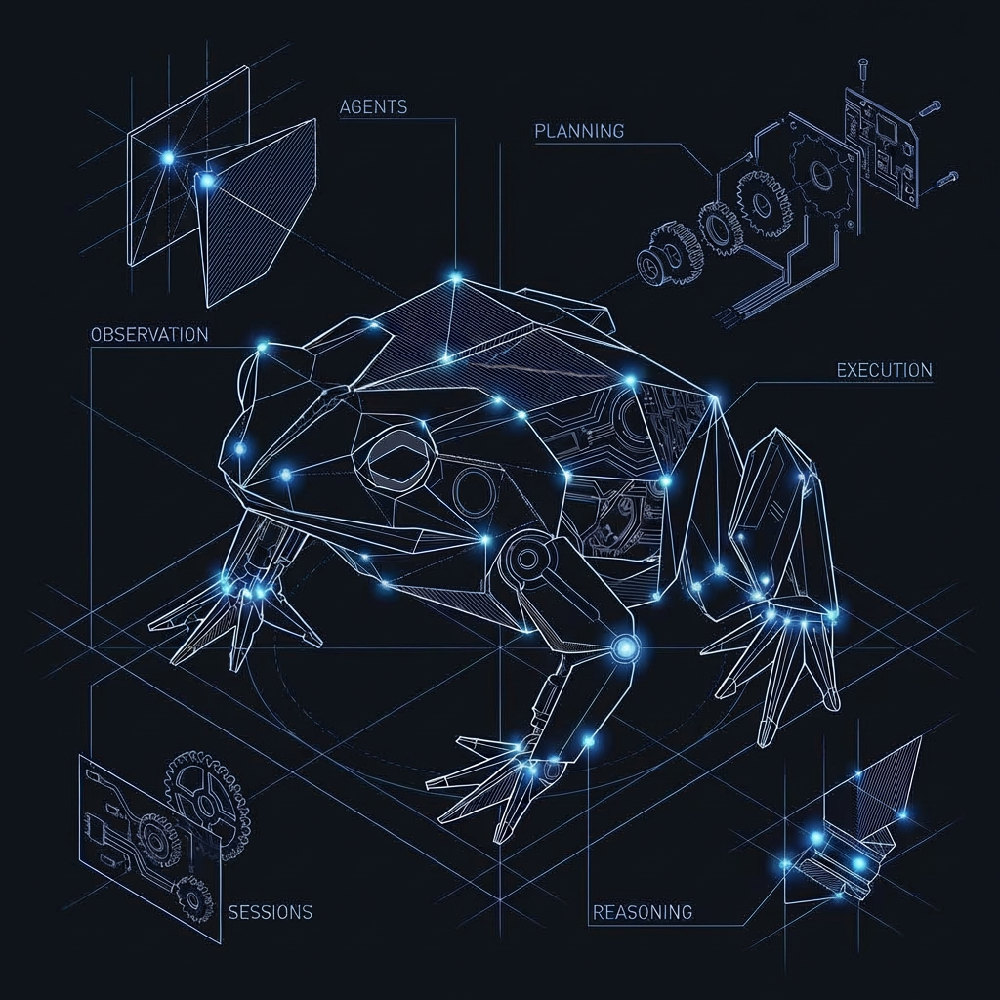

# bufo

`bufo` is a terminal-first, web-second UI framework for ACP-compatible AI agents.

It provides one Textual-based control plane for agent prompting, persistent shell execution, session resume, settings, and local metadata persistence.

<p align="center">
  
</p>

> ⚠️ **Status:** Bufo is a new work in progress and is not yet ready for production use.
> Contributions are very welcome.

## Current capabilities

- Agent store / launcher with built-in catalog descriptors and custom overrides.
- Mode-backed multi-session runtime with resumable metadata in SQLite.
- Conversation workspace that merges agent prompting, slash commands, and persistent shell commands.
- Slash-command suggestion popup (type `/`, cycle suggestions, apply quickly).
- JSON-RPC transport + ACP bridge for process-based agents over stdio.
- ACP session-scoped compatibility for strict servers: negotiated `sessionId` is reused for prompt/mode/cancel calls.
- Bridge fail-fast behavior for startup/RPC calls when agent processes exit early or stop responding.
- ACP prompt payload shaping with text/resource blocks plus legacy fallback behavior.
- ACP update normalization for both typed events and nested `sessionUpdate` payload variants (mode, commands, message chunks).
- ACP-only launcher enforcement (non-ACP catalog entries are rejected with an explicit error).
- Permission modal workflow, diff rendering helpers, command risk analysis.
- Project-scoped prompt/shell histories and XDG-based config/state/data layout.
- Project tree panel with scanner + watchdog-driven auto refresh.
- Session strip with per-session chat tabs and quick "New Session" entry.
- Drag-selection in logs with auto-copy and in-app clipboard notification.
- Structured JSONL runtime logging with CLI/env level gating.
- Agent stderr lines are written to runtime logs (not rendered in the chat timeline).

## CLI

```bash
# default run command
bufo

# launch directly into a catalog ACP agent
bufo run --agent claude-code

# open launcher/store explicitly
bufo run --store

# enable runtime debug logs (JSONL)
BUFO_LOG_LEVEL=debug bufo run --log-file /tmp/bufo.runtime.jsonl

# serve in browser via textual-serve
bufo serve --host 127.0.0.1 --port 8123

# run a custom ACP command
bufo acp "my-agent --acp" --name "My Agent" /path/to/project

# print settings location
bufo settings-path

# app metadata
bufo about

# replay JSONL events for ACP debugging
bufo replay ./events.jsonl --limit 100
```

## Example: custom ACP agent

```bash
bufo acp \
  "acme-agent --acp --config ./acme-agent.toml --cwd ." \
  --name "Acme Agent" \
  .
```

## Testing

```bash
# full test suite (unit + integration + e2e)
uv run python -m unittest discover -s tests -v
```

The suite currently covers core persistence/protocol paths, ACP bridge compatibility, ACP update normalization, JSONL runtime logging, CLI integration, and end-to-end Textual app flows (50 tests).

## Notes

- Browser serving is wired through `textual-serve` when available in the environment.
- Runtime requires Textual and ACP tooling installed in your local environment.
